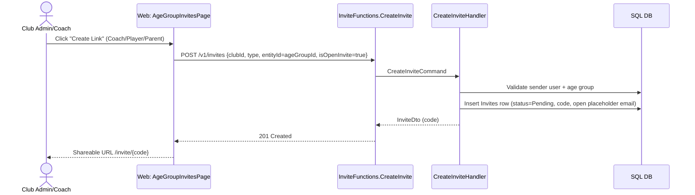
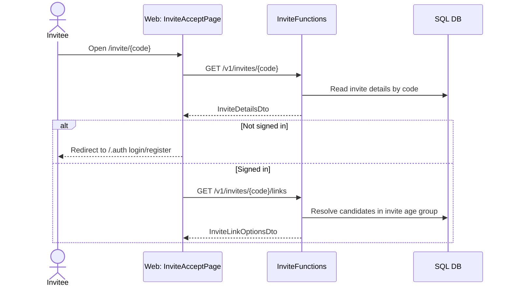
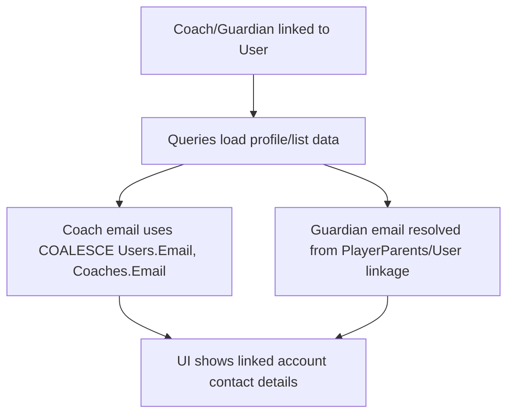

# Invite Linking Flow (Reusable Age Group Links)

This document explains the current invite flow for:

- Coach (single link)
- Player (single link)
- Player Parent (multi link)

and shows what is persisted at each stage.

---

## 1) Create reusable invite links (Age Group Invites tab)



### Data persisted

- `Invites`
  - `Code` (share token)
  - `Type` (Coach/Player/Parent)
  - `EntityId` = `AgeGroupId` (for reusable age-group scope)
  - `Status` = `Pending`
  - `Email` = open-invite placeholder
  - `CreatedByUserId`, `CreatedAt`, `ExpiresAt`

---

## 2) User opens invite link and authenticates



### Data persisted

- No writes during read/auth stage.
- Authentication provider establishes principal used by API.

---

## 3) Save links (post-login self-service linking)

```mermaid
sequenceDiagram
    actor User as Invitee
    participant UI as Web: InviteAcceptPage
    participant API as InviteFunctions.UpdateInviteLinks
    participant UH as UpdateInviteLinksHandler
    participant DB as SQL DB

    User->>UI: Select entities and click Save
    UI->>API: PUT /v1/invites/{code}/links {selectedEntityIds[]}
    API->>UH: UpdateInviteLinksCommand
    UH->>DB: Validate invite pending + open invite + user
    UH->>DB: Create Users row if missing

    alt Invite type = Player (single)
        UH->>DB: Unlink previous Player.UserId for current user
        UH->>DB: Set selected Player.UserId = current user
    else Invite type = Coach (single)
        UH->>DB: Unlink previous Coach.UserId for current user
        UH->>DB: Set selected Coach.UserId = current user; HasAccount=true
    else Invite type = Parent (multi)
        UH->>DB: Remove unselected PlayerParents rows for current user in age group
        UH->>DB: Insert missing PlayerParents rows for selected players
    end

    UH-->>API: AcceptInviteResultDto
    API-->>UI: 200 OK
```

### Data persisted

- `Users`
  - Upsert-like behavior by `AuthId` (create if absent).
- `Players`
  - Single-link flow uses `Players.UserId`.
- `Coaches`
  - Single-link flow uses `Coaches.UserId`, updates `HasAccount`.
- `PlayerParents`
  - Multi-link flow inserts/removes rows for selected players.

---

## 4) Contact data resolution after linking



### Data read behavior

- Coach queries now prefer linked `Users.Email` when present.
- Player guardian display includes linked email when it can be resolved via `PlayerParents`/`Users`.

---

## Role constraints summary

- **Coach**: one user ↔ one coach at a time (self-switch supported).
- **Player**: one user ↔ one player at a time (self-switch supported).
- **Player Parent**: one user ↔ many players (add/remove supported).
